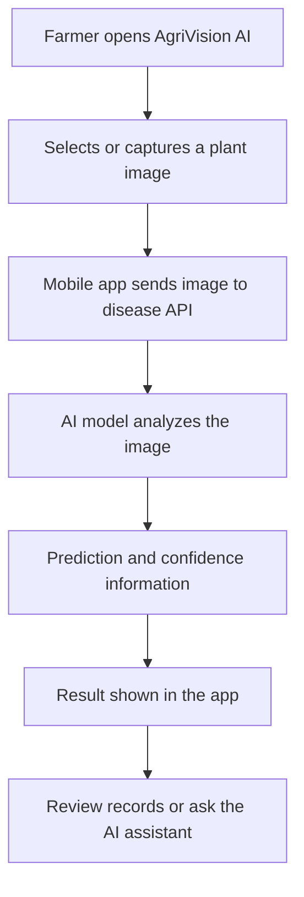
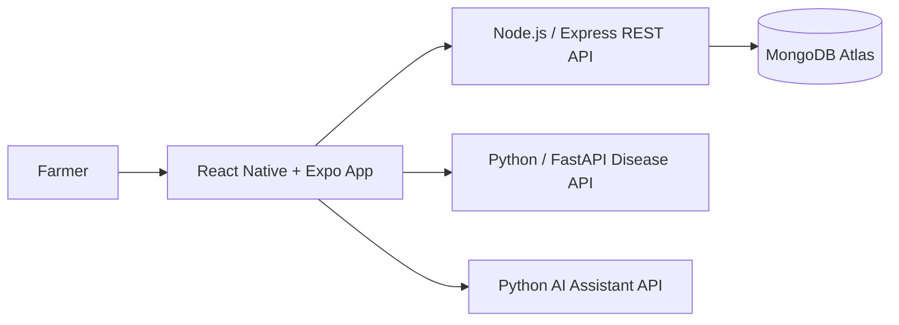

<div align="center">

# 🌱 AgriVision AI

### Your crops. Your insights. Smarter farming.

**An AI-powered mobile companion for crop health monitoring, wheat disease diagnosis, and practical farming guidance.**

<p>
  
  
  
  
</p>

[Explore Repository](https://github.com/Harshsaxena13/Agrivision_Frontend) · [Report a Bug](https://github.com/Harshsaxena13/Agrivision_Frontend/issues) · [Connect on LinkedIn](https://www.linkedin.com/in/harshsaxena13/)

</div>

---

## 🌾 About the Project

Agriculture depends on healthy crops, but identifying disease early can be difficult without timely access to expert guidance. **AgriVision AI** is a mobile application concept built to make crop-health monitoring more accessible through AI-assisted diagnosis and a farmer-friendly experience.

Users can organize crop information, scan plant images for disease analysis, review previous scans, and ask an AI assistant crop-related questions—all from one mobile interface.

> **Project focus:** bringing crop monitoring, AI-assisted disease screening, and farming guidance together in one practical mobile experience.

## 📱 App Preview

<p align="center">
  
  &nbsp;&nbsp;
  
</p>

<p align="center">
  <em>Welcome experience and farmer dashboard from the AgriVision AI mobile app.</em>
</p>

## ✨ Key Features

| Feature | What it does |
|---|---|
| 🌿 **AI-assisted plant scanning** | Submit a plant image for disease analysis through the connected prediction service. |
| 🧠 **Farming AI assistant** | Ask crop-related questions and receive AI-generated guidance. |
| 📊 **Crop health dashboard** | Review crop status summaries and field-level information. |
| 🗂️ **Scan history** | Revisit previous scan records and monitor observations over time. |
| 🌱 **Plant growth tracking** | Keep growth-related information organized for easier monitoring. |
| 📄 **Reports** | Access crop information in a report-oriented workflow. |
| 👤 **Farmer profile** | Keep the farmer experience organized in one place. |
| 📱 **Mobile-first experience** | Designed around a clear, accessible interface for phone screens. |

*Feature availability can depend on the configured backend and AI services.*

## 🧠 How It Works



The mobile interface acts as the farmer's entry point. Dedicated services handle application data, image-based disease prediction, and AI-assisted conversation.

## 🏗️ System Architecture



### Service responsibilities

- **Mobile frontend:** screens, navigation, image selection, and API communication.
- **Application backend:** REST endpoints and application data workflows.
- **Database:** persistent storage for supported application records.
- **Disease prediction service:** receives plant images and returns model predictions.
- **AI assistant service:** handles crop-related conversational guidance.

The diagram represents the intended service separation; configure the URLs and environment variables to match your deployment.

## 🛠️ Technology Stack

| Layer | Technologies |
|---|---|
| Mobile app | React Native, Expo |
| Application API | Node.js, Express.js |
| Data storage | MongoDB / MongoDB Atlas |
| Disease detection API | Python, FastAPI, PyTorch |
| AI assistant | Python API service and LLM/RAG components, depending on configuration |
| Development tools | Git, GitHub, VS Code, Postman |

## 🌿 Wheat Disease Detection

The disease-detection service has been developed for wheat-plant image analysis. The model's configured classes include:

- Blast
- Brown Rust
- Fusarium Head Blight
- Healthy Wheat
- Leaf Blight
- Mildew
- Septoria
- Smut
- Tan Spot
- Yellow Rust

Predictions are model outputs, not a substitute for confirmation from an agricultural expert. Results may vary with image quality, lighting, crop variety, and field conditions.

## 🚀 Getting Started

This repository contains the **mobile frontend**. The backend, disease prediction API, and AI assistant may need to be run separately.

### Prerequisites

- Node.js and npm
- Git
- Expo-compatible development environment
- Access to the required backend and AI API endpoints

### 1. Clone the repository

```bash
git clone https://github.com/Harshsaxena13/Agrivision_Frontend.git
cd Agrivision_Frontend
```

### 2. Install dependencies

```bash
npm install
```

### 3. Configure environment variables

Check the project's existing configuration and environment-variable names before adding values. A typical setup may need URLs for:

```env
# Example names only — use the exact names expected by this project
EXPO_PUBLIC_API_URL=http://YOUR_COMPUTER_LAN_IP:5000
EXPO_PUBLIC_DISEASE_API_URL=http://YOUR_COMPUTER_LAN_IP:8000
EXPO_PUBLIC_AI_API_URL=http://YOUR_COMPUTER_LAN_IP:8001
```

Replace the example addresses with your actual service URLs. For a physical phone using a local development server, use your computer's LAN IP address rather than `localhost`, and keep both devices on the same Wi-Fi network. Do not commit credentials, private API keys, or production secrets.

### 4. Start the Expo app

```bash
npx expo start
```

Follow the Expo CLI instructions to open the app on a compatible device or simulator.

### 5. Start connected services

Start each backend/API using its own repository instructions. Confirm the endpoints are reachable from the device and that the frontend's configured URLs match the running services.

## 📁 Repository Scope

This repository is the **AgriVision AI mobile frontend**. Related services are maintained separately:

- [Mobile Frontend](https://github.com/Harshsaxena13/Agrivision_Frontend)
- [Wheat Disease Prediction API](https://github.com/Harshsaxena13/Wheat_Disease_Api)
- [AgriVision Backend](https://github.com/Harshsaxena13/Agrivision_Backend)

The actual folder layout and available scripts may change as the project evolves. Refer to the source files and `package.json` for the current implementation.

## 🔭 Future Improvements

- Expand crop and disease coverage with validated datasets.
- Improve diagnosis explanations and confidence calibration.
- Add multilingual and voice-friendly farmer guidance.
- Build clearer longitudinal crop-health analytics.
- Strengthen offline and low-connectivity workflows.
- Add more field-tested treatment guidance with agricultural expert review.

## 🎓 Project Context

AgriVision AI is being developed as an applied software and AI project focused on mobile crop-health monitoring and disease diagnosis. The project has also been part of the developer's IIT Ropar internship work. Add the relevant faculty collaborator's name and role here only after confirming the preferred public wording.

## 👨‍💻 Author

**Harsh Saxena**  
Full-Stack Developer | AI & Backend Enthusiast

- GitHub: [@Harshsaxena13](https://github.com/Harshsaxena13)
- LinkedIn: [harshsaxena13](https://www.linkedin.com/in/harshsaxena13/)
- LeetCode: [harshsxna__](https://leetcode.com/u/harshsxna__/)

## ⚠️ Disclaimer

AgriVision AI is intended to support crop observation and early investigation. AI-generated predictions and advice may be incorrect or incomplete. For high-impact crop-treatment decisions, verify results with qualified agricultural professionals and follow local product labels and guidance.

---

<div align="center">

**Built with 🌱 for smarter crop care.**

If you find the project interesting, consider giving the repository a ⭐

</div>
